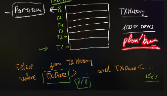
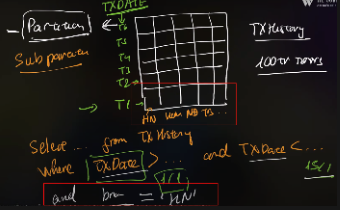
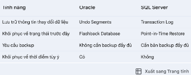
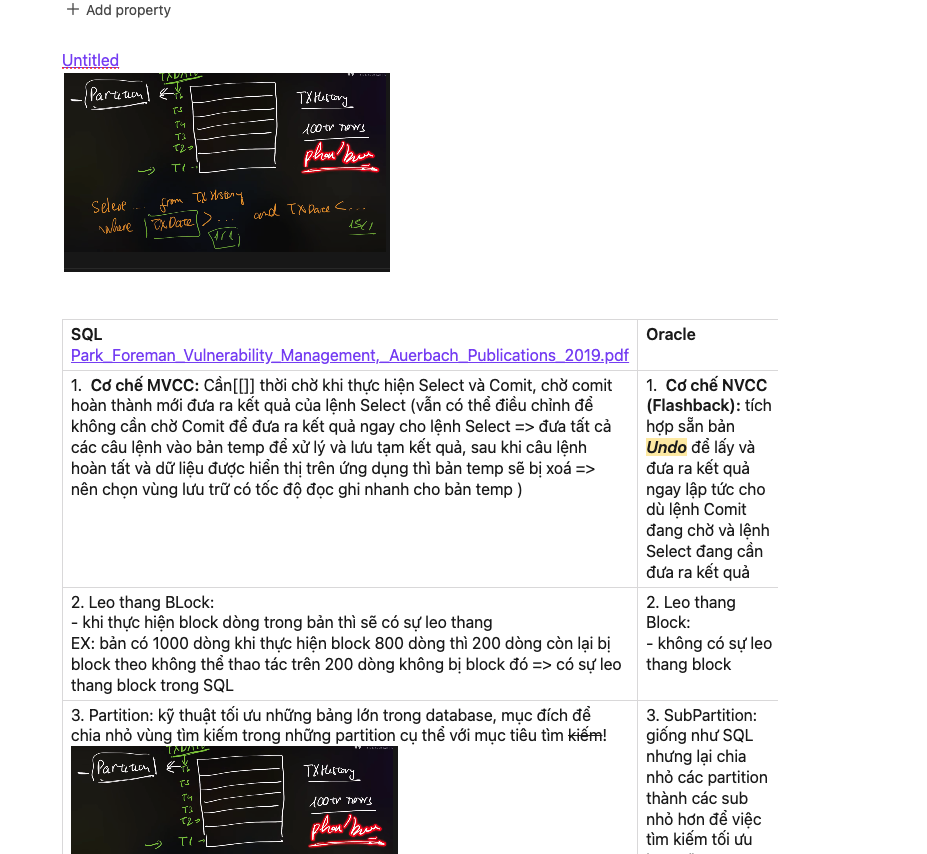

[[obsidian://open?vault=my-notes&file=content%2FPark_Foreman_Vulnerability_Management%2C_Auerbach_Publications_2019.pdf ]]

| SQL                                                                                                                                                                                                                                                                                                                                                                                                                                                 | Oracle                                                                                                                                                                                                                                                                                                                                                                                                                                                                                      |
| --------------------------------------------------------------------------------------------------------------------------------------------------------------------------------------------------------------------------------------------------------------------------------------------------------------------------------------------------------------------------------------------------------------------------------------------------- | ------------------------------------------------------------------------------------------------------------------------------------------------------------------------------------------------------------------------------------------------------------------------------------------------------------------------------------------------------------------------------------------------------------------------------------------------------------------------------------------- |
| 1.  **Cơ chế MVCC:** Cần[[]] thời gian chờ khi thực hiện Select và Comit, chờ comit hoàn thành mới đưa ra kết quả của lệnh Select (vẫn có thể điều chỉnh để không cần chờ Comit để đưa ra kết quả ngay cho lệnh Select => đưa tất cả các câu lệnh vào bản temp để xử lý và lưu tạm kết quả, sau khi câu lệnh hoàn tất và dữ liệu được hiển thị trên ứng dụng thì bản temp sẽ bị xoá => nên chọn vùng lưu trữ có tốc độ đọc ghi nhanh cho bản temp ) | 1.  **Cơ chế NVCC (Flashback):** tích hợp sẵn bản ==***Undo***== để lấy và đưa ra kết quả ngay lập tức cho dù lệnh Comit đang chờ và lệnh Select đang cần đưa ra kết quả                                                                                                                                                                                                                                                                                                                    |
| 2. Leo thang BLock: - khi thực hiện block dòng trong bản thì sẽ có sự leo thang  EX: bản có 1000 dòng khi thực hiện block 800 dòng thì 200 dòng còn lại bị block theo không thể thao tác trên 200 dòng không bị block đó => có sự leo thang block trong SQL                                                                                                                                                                                   | 2. Leo thang Block: - không có sự leo thang block                                                                                                                                                                                                                                                                                                                                                                                                                                        |
| 3. Partition: kỹ thuật tối ưu những bảng lớn trong database, mục đích để chia nhỏ vùng tìm kiếm trong những partition cụ thể với mục tiêu tìm ~~kiếm~~                                                                                                                                                                                                                                                          | 3. SubPartition: giống như SQL nhưng lại chia nhỏ các partition thành các sub nhỏ hơn để việc tìm kiếm tối ưu hơn nữa                                                                                                                                                                                                                                                                                                                                    |
| 4. Index: SQL hỗ trợ index Bibmap kém hơn Oracle                                                                                                                                                                                                                                                                                                                                                                                                    | 4. Index: hỗ trợ index Bibmap tốt hơn rất nhiều trong việc phân loại các thuộc tính nhỏ it trường hợp                                                                                                                                                                                                                                                                                                                                                                                       |
| 5. Parallel: chỉ hỗ trợ cho câu lệnh select, các câu lệnh còn lại thực hiện tuần tự => lạm dụng câu lệnh có chứa Parallel sẽ làm cho tất cả các nhân của CPU hoạt động vượt công suất dẫn đến treo CPU                                                                                                                                                                                                                                              | 5. Parallel: hỗ trợ cho tất cả các câu lệnh =>  lạm dụng câu lệnh có chứa Parallel sẽ làm cho tất cả các nhân của CPU hoạt động vượt công suất dẫn đến treo CPU                                                                                                                                                                                                                                                                                                                             |
| 6. Report and Analysis: có thể bật thông tin Qerry cho một số câu lệnh nhưng không tổng thể cho Database ==(tìm hiểu lại trong khoá học MS SQL SERVER đã tham gia ở Robusta)==                                                                                                                                                                                                                                                                      | 6. Report and Analysis (AWR): công cụ xuất báo cáo rất chi tiết tất cả các thông tin của Oracle Database                                                                                                                                                                                                                                                                                                                                                                                 |
| 7. Lấy lại dữ liệu chi tiết: SQL chỉ có thể khôi phục lại toàn bộ database dựa trên file backup đã tạo                                                                                                                                                                                                                                                                                                          | 7. Lấy lại dữ liệu chi tiết từ bản Undo: Oracle có thể lấy lại dữ liệu rất chi tiết từ bản Undo mà không cần thực hiện khôi phục dữ liệu của toàn database (với câu lệnh: tạo bản backup từ Undo thời gian lấy lại là 5 phút trước khi sai sót sảy ra ==create table wecommitbackup==  ==as== ==SELECT *== ==FROM wecommitdemo== ==AS OF TIMESTAMP== ==(SYSTIMESTAMP - INTERVAL '5' MINUTE);== ==Select * from wecommitbackup== 'kiểm tra lại bản backup lấy từ Undo') |
| 8. Ransomware: mục tiêu bị mã hoá thông dụng                                                                                                                                                                                                                                                                                                                                                                                                        | 8. Ransomware: ít bị tấn công hơn, do không phổ biến và cấu trúc database phức tạp hơn                                                                                                                                                                                                                                                                                                                                                                                                      |
| 9. RAC: chỉ chạy ở chế độ Active và Stanby (1 server chỉ làm nhiệm vụ Write thì server còn lại sẽ là Read)                                                                                                                                                                                                                                                                                                                                          | 9. RAC: có thể cấu hình chạy trên cả 2 server chạy cùng chế độ Active + Active (cả hai server điều có thể cùng Write cùng Read truy xuất dữ liệu rất nhanh và ổn định)                                                                                                                                                                                                                                                                                                                      |
| 10. Giá : rẻ hơn 1/2 so với Oracle do không tính tiền giá Cost và tiền bảo trì năm đầu tiên                                                                                                                                                                                                                                                                                                                     | 10. Giá: rất cao do tính tiền giá Cost và bảo trì năm đầu                                                                                                                                                                                                                                                                                                                                                                                                                                   |
|                                                                                                                                                                                                                                                                                                                                                                                                                                                     |                                                                                                                                                                                                                                                                                                                                                                                                                                                                                             |
